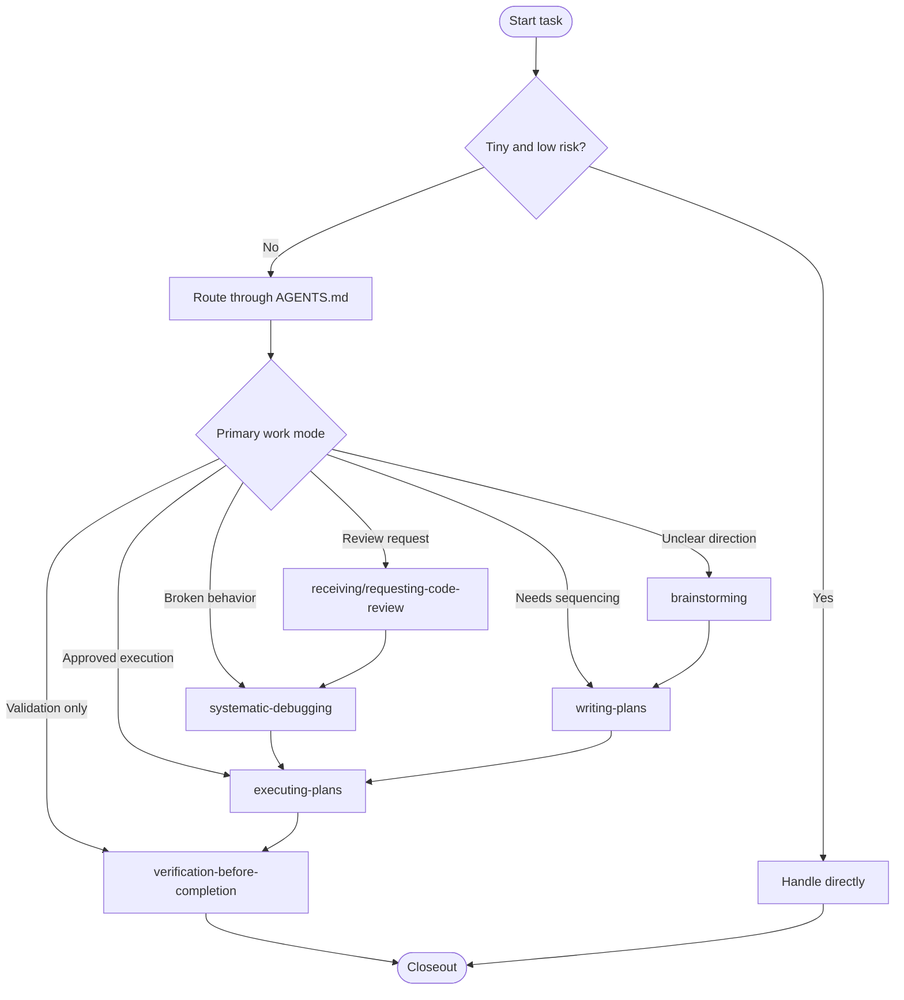

# leaserage

Personal agent workflow installer for OpenCode, Kilo CLI, Codex, Claude Code, Cursor, and GitHub Copilot.

## Workflow Orchestration

Leaserage installs a compact workflow router inspired by Radforge's orchestration model:

- `AGENTS.md` decides when to route, pause, validate, or close out work.
- Skills decide how to run one focused mode such as systematic debugging, code review, planning, execution, TDD, verification, or brainstorming.
- One primary workflow skill should be active at a time. A skill may finish, pause for approval, or hand off to one next skill.

High-level flow:



Everyday routing:

```txt
systematic-debugging           broken behavior, failing command, regression, incident
receiving-code-review          respond to incoming review feedback
requesting-code-review         inspect completed work for bugs, risk, missing validation
brainstorming                  unclear goal, open design question, multiple viable approaches
writing-plans                  clear work that needs sequencing, checkpoints, rollback thinking
executing-plans                execute an approved written plan inline
subagent-driven-development    execute an approved plan with task-focused subagents
test-driven-development        implement behavior changes or bugfixes test-first
verification-before-completion validate before claiming completion
direct                         tiny one-step task where routing would add noise
```

Escalation rules:

- ambiguity during execution -> `brainstorming`
- growing scope or dependency ordering -> `writing-plans`
- failed validation or reproduced breakage -> `systematic-debugging`
- meaningful design, sequencing, destructive, or irreversible decision -> pause for approval

For the full workflow state machine, approval gates, handoffs, and stop states, see `documents/leaserage-full-orchestration.md`.

## Providers

Supported provider IDs:

```txt
opencode
kilo
codex
claude-code
cursor
github-copilot
```

Install one provider:

```bash
leaserage install --provider opencode
```

Install multiple providers:

```bash
leaserage install --provider opencode,kilo,codex,claude-code,cursor,github-copilot
```

Preview without writing:

```bash
leaserage install --provider opencode,kilo --dry-run
```

Install without MCP config:

```bash
leaserage install --provider opencode,kilo --mcp none
```

Install and initialize supported RTK hooks:

```bash
leaserage install --provider claude-code,cursor,opencode,codex,github-copilot --hook rtk
```

`--with-rtk` is an alias for `--hook rtk`.

Check installed config:

```bash
leaserage doctor --provider opencode,kilo
```

Check MCP and RTK hook dependencies:

```bash
leaserage doctor --provider claude-code,cursor --hook rtk
```

Remove Leaserage-managed files:

```bash
leaserage uninstall --provider opencode,kilo
```

## Install From GitHub Release

### Linux Or macOS

Install the latest release and immediately configure providers:

```bash
curl -fsSL https://github.com/leaser019/leaserage/releases/latest/download/install.sh | bash -s -- install --provider opencode,kilo
```

Install a pinned version:

```bash
LEASERAGE_VERSION=download/v0.0.2 curl -fsSL https://github.com/leaser019/leaserage/releases/latest/download/install.sh | bash -s -- install --provider codex,claude-code
```

Use another fork or repository:

```bash
LEASERAGE_REPO=your-name/leaserage curl -fsSL https://github.com/your-name/leaserage/releases/latest/download/install.sh | bash -s -- install --provider cursor
```

### Windows PowerShell

Install the latest release and configure providers:

```powershell
& ([scriptblock]::Create((irm "https://github.com/leaser019/leaserage/releases/latest/download/install.ps1"))) install --provider opencode,kilo
```

Install a pinned version:

```powershell
& ([scriptblock]::Create((irm "https://github.com/leaser019/leaserage/releases/latest/download/install.ps1"))) -Version "download/v0.0.2" install --provider codex,claude-code
```

Use another fork or repository:

```powershell
& ([scriptblock]::Create((irm "https://github.com/your-name/leaserage/releases/latest/download/install.ps1"))) -Repo "your-name/leaserage" install --provider cursor
```

## Download Binary Manually

Download the matching asset from GitHub Releases:

```txt
leaserage-linux-amd64.tar.gz
leaserage-linux-arm64.tar.gz
leaserage-windows-amd64.zip
leaserage-windows-arm64.zip
leaserage-darwin-amd64.tar.gz
leaserage-darwin-arm64.tar.gz
```

Linux/macOS:

```bash
tar -xzf leaserage-linux-amd64.tar.gz
chmod +x leaserage
./leaserage install --provider opencode,kilo
```

Windows PowerShell:

```powershell
Expand-Archive .\leaserage-windows-amd64.zip -DestinationPath .
.\leaserage.exe install --provider opencode,kilo
```

Verify checksums:

```bash
sha256sum -c checksums.txt
```

## Build From Source

```bash
git clone https://github.com/leaser019/leaserage.git
cd leaserage
go build -o leaserage ./cmd/leaserage
./leaserage install --provider opencode,kilo
```

Cross-compile examples:

```bash
GOOS=linux GOARCH=amd64 go build -o dist/leaserage-linux-amd64 ./cmd/leaserage
GOOS=windows GOARCH=amd64 go build -o dist/leaserage-windows-amd64.exe ./cmd/leaserage
GOOS=darwin GOARCH=arm64 go build -o dist/leaserage-darwin-arm64 ./cmd/leaserage
```

## Provider Targets

Leaserage writes user-level config by default:

```txt
opencode        ~/.config/opencode
kilo            ~/.config/kilo
codex           ~/.codex
claude-code     ~/.claude
cursor          ~/.cursor
github-copilot  ~/.github-copilot
```

## MCP And Hook Options

Default install mode writes provider instructions, Leaserage skills, and MCP config where the provider supports MCP.

```txt
--mcp default   write MCP config templates when supported (default)
--mcp none      skip MCP config; OpenCode and Kilo still receive instruction-only config
--hook none     do not initialize command-output hooks (default)
--hook rtk      use official RTK install/init for supported providers
```

MCP servers configured by default:

```txt
serena     uvx --from git+https://github.com/oraios/serena serena start-mcp-server
codegraph  codegraph serve --mcp
dbhub      npx -y @bytebase/dbhub (disabled by default)
```

RTK hook support uses the official `rtk init` commands from RTK. If `rtk` is missing on Linux/macOS, Leaserage runs the official installer first. On native Windows, install RTK manually or use WSL for full hook support.

```txt
claude-code      rtk init --global
cursor           rtk init --global --agent cursor
opencode         rtk init --global --opencode
github-copilot   rtk init --global --copilot
codex            rtk init --global --codex
kilo             prompt-level guidance only; no global RTK hook is initialized
```

RTK is not an MCP server. It is a CLI proxy plus provider hook/plugin or prompt-level guidance that rewrites supported commands through `rtk rewrite`.

Use `--home` for testing or custom install roots:

```bash
tmp_home="$(mktemp -d)"
leaserage install --provider opencode,kilo --home "$tmp_home"
find "$tmp_home" -type f | sort
```

## Development

```bash
go verification-before-completion ./...
go run ./cmd/leaserage --help
```

## Release

Production releases are created from Git tags. Merge stable code to `main`, then tag the release commit:

```bash
git checkout main
git pull origin main
git tag v0.1.0
git push origin v0.1.0
```

The `release` workflow builds and publishes assets for:

- Linux: `amd64`, `arm64`
- Windows: `amd64`, `arm64`
- macOS: `amd64`, `arm64`
