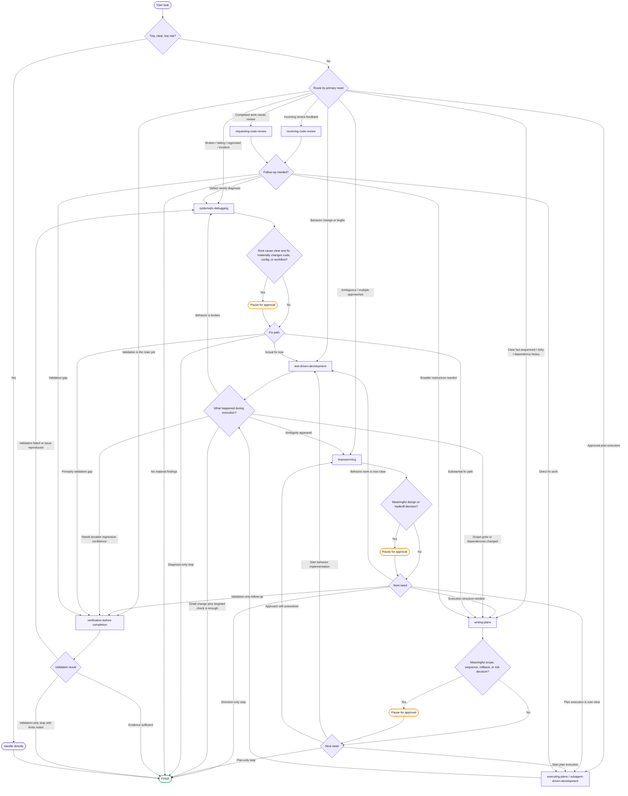

# Leaserage Full Orchestration

This document captures the full Leaserage workflow state machine implied by the installed `AGENTS.md` and workflow skills. Use this when you need the broader routing model, approval gates, validation handoffs, and stop states. For day-to-day usage, the shorter README diagram is enough.

## Routing Basis

- `systematic-debugging`: broken behavior, failing command, regression, unexpected output, or incident.
- `receiving-code-review`: respond to incoming review feedback.
- `requesting-code-review`: inspect completed work for bugs, regressions, missing validation, and risk.
- `brainstorming`: unclear goal, unresolved design, tradeoff, or multiple viable approaches.
- `writing-plans`: clear work that needs sequencing, dependency ordering, checkpoints, or rollback thinking.
- `executing-plans`: execute an approved written plan inline.
- `subagent-driven-development`: execute an approved written plan with task-focused subagents.
- `test-driven-development`: implement behavior changes or bugfixes test-first.
- `verification-before-completion`: validation-only request, confidence check, or regression proof.
- direct handling: tiny low-risk task where workflow routing would add noise.

## Approval Gates

Pause for approval before:

- meaningful design or tradeoff decisions after brainstorming
- substantial execution plans with risk, sequencing, or rollback choices
- destructive, irreversible, broad, or production-sensitive changes
- systematic-debugging fixes that materially change code, config, workflow, data, auth, payment, or deployment behavior

Approval gates are conditional. Do not pause for every small edit, but do not skip approval for irreversible or high-risk actions.

## Handoff Rules

- ambiguity during execution -> `brainstorming`
- scope growth or dependency ordering -> `writing-plans`
- failed validation or reproduced breakage -> `systematic-debugging`
- direct implementation that needs more proof -> `verification-before-completion`
- review finding with root cause unknown -> `systematic-debugging`
- review finding with obvious narrow fix -> `test-driven-development` or `executing-plans`

## Evidence Rules

- Do not claim success without fresh evidence.
- Run the narrowest high-signal check first.
- Broaden validation when risk, blast radius, or user-facing behavior requires it.
- If validation is skipped, state exactly why.
- Distinguish observed evidence from assumptions and environment limits.

## Stop States

Finish only when the current workflow has a clear stop state:

- direct task completed and read back or checked
- systematic-debugging root cause explained and fix verified, or diagnosis-only stop requested
- review findings reported with file/line evidence
- writing-plans delivered as a handoff artifact
- implementation verified with relevant checks
- verification-before-completion workflow reports evidence, failures, or explicit limits
